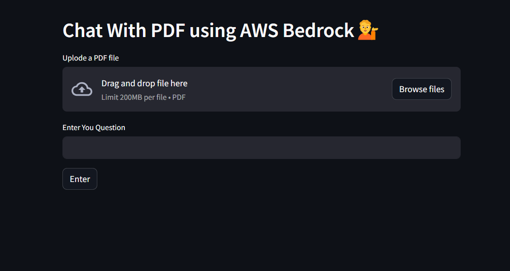
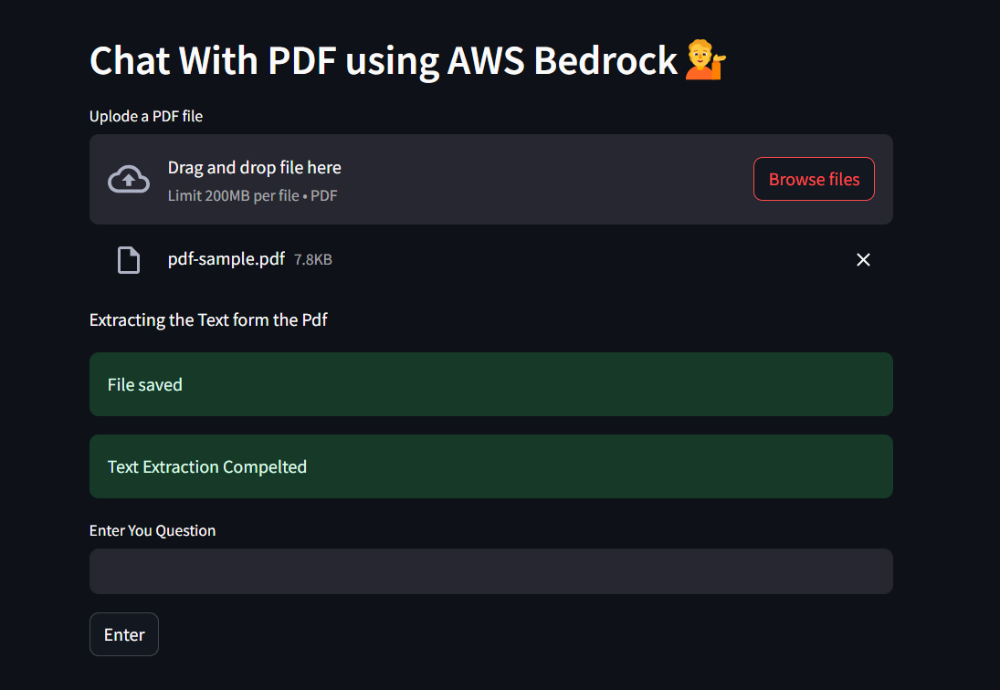
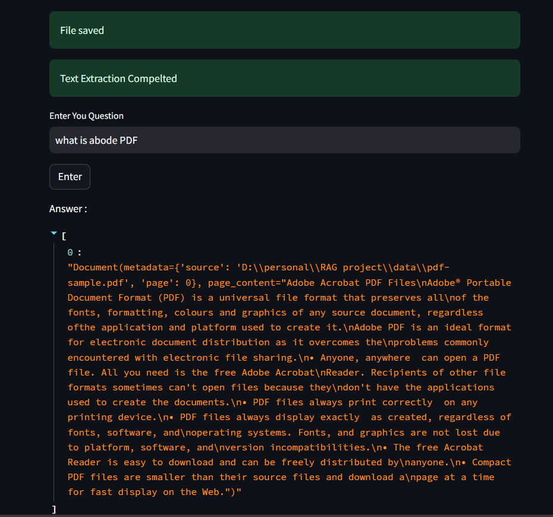

# DOC CHAT

A powerful chatbot system that allows users to upload a PDF document and ask questions related to the document. The chatbot uses Retrieval Augmented Generation (RAG) to provide accurate answers by referring to the provided document.

## About The Project

This project is a document-based chatbot that allows users to upload PDF documents and ask questions about the content. The system uses **Retrieval Augmented Generation (RAG)** to find relevant information from the document and provides answers using a Large Language Model (LLM). The chatbot is designed to work with PDFs, using **AWS Textract** and **PyPDF** for text extraction. It leverages **AWS Bedrock**, specifically **AWS Textract** and **AWS Anthropic Claude**, to generate the most relevant answers.

### Key Features
- Upload PDF documents for easy question-answering.
- Utilizes **AWS Textract** and **PyPDF** for extracting text from PDFs.
- **AWS Claude** LLM provides highly relevant answers using extracted content.
- Streamlit-based web application for a smooth and interactive user interface.

## Built With

This project leverages the following technologies:
- **Retrieval Augmented Generation (RAG)**: For retrieving and generating answers from the document.
- **AWS Bedrock**: To integrate AI services, including Textract and Claude.
- **AWS Textract**: To extract text from PDF documents.
- **PyPDF**: As an alternative method for text extraction.
- **AWS Anthropic Claude**: The large language model for generating answers.
- **Streamlit**: To build the web application and user interface.

### Prerequisites

Make sure you have the following installed:
- Python 3.8+
- AWS Account
- Streamlit
- AWS CLI configured with Textract and Bedrock permissions
- PyPDF

### Usage
- Run the Streamlit application:
    - streamlit run app.py
- Upload your PDF document through the web interface.

    

- Ask any question related to the document, and the chatbot will provide the most relevant answer using RAG and AWS Claude.

    

### Roadmap
- Add support for other document formats (Word, Excel).
- Improve text extraction accuracy with more advanced NLP methods.
- Integrate other LLMs for multilingual support.
- Expand cloud infrastructure for higher scalability.
- Build mobile support for Android/iOS.
